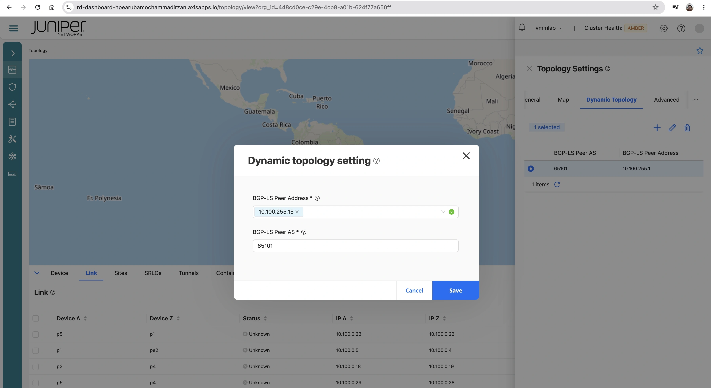
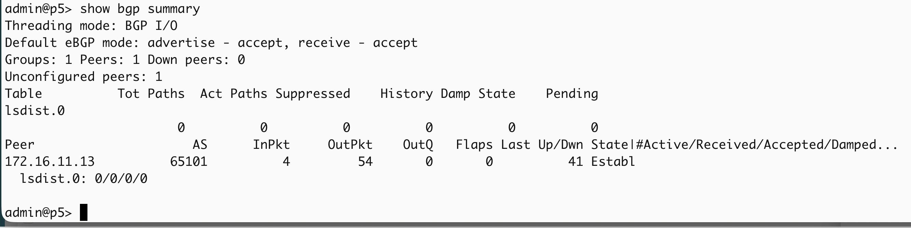
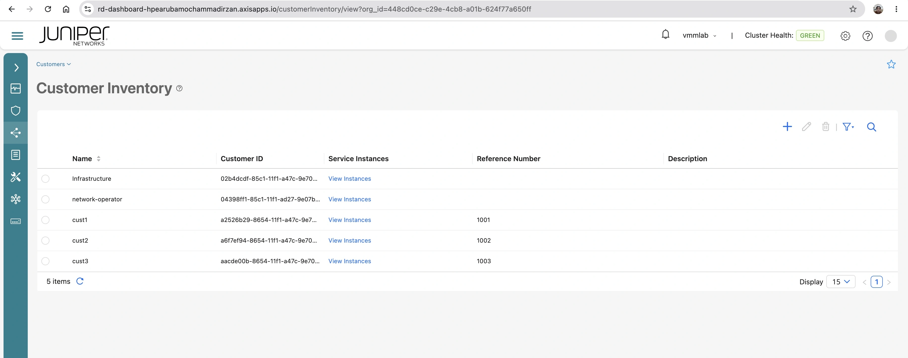
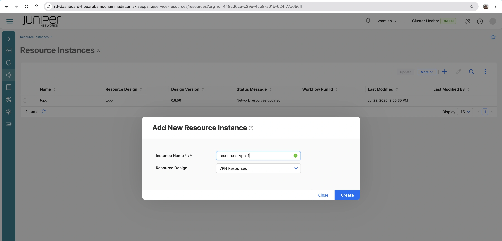
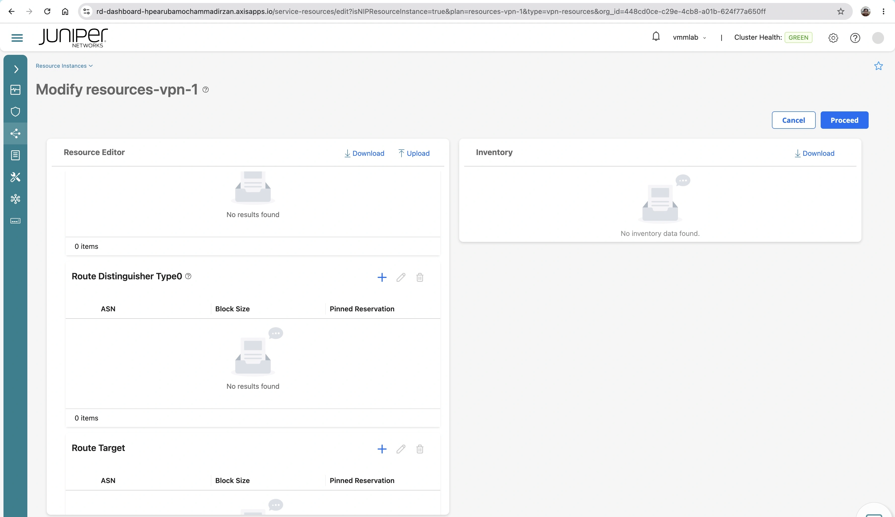
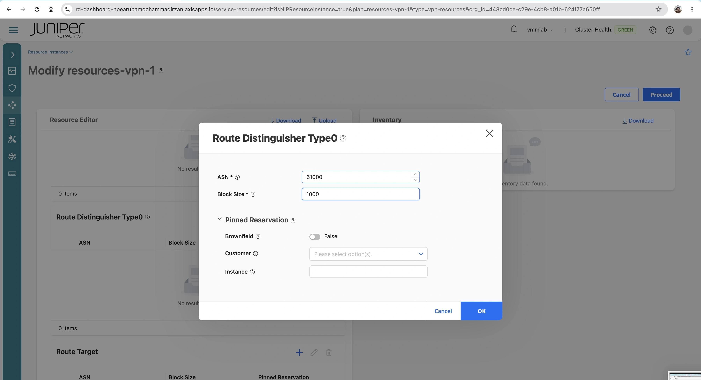
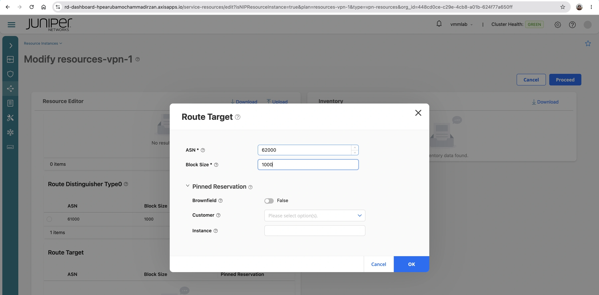
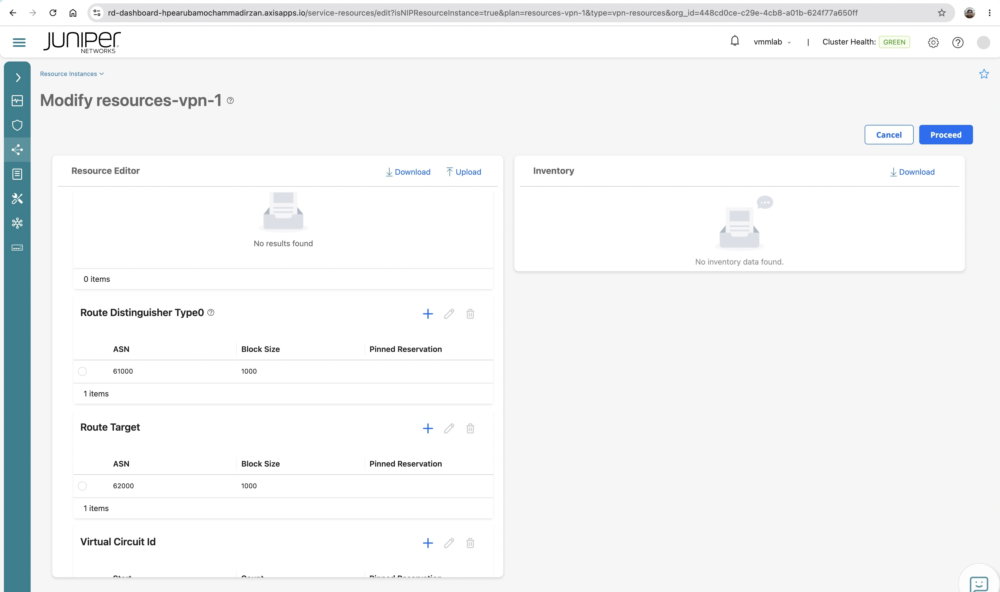
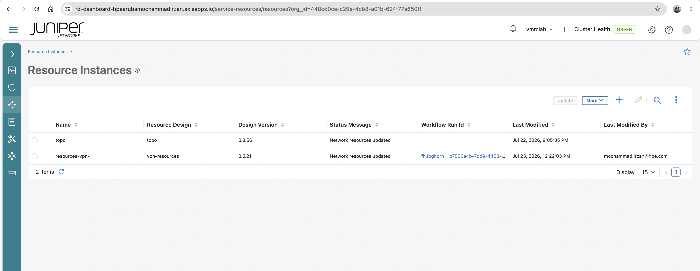

# Lab Exercise 2

## Enable BGP-LS on routing director

1. open ssh session into node p5, and verify that BGP-LS has been configured

        admin@p5> show configuration protocols bgp
        group to_RD {
            type internal;
            local-address 10.100.255.15;
            passive;
            family traffic-engineering {
                unicast;
            }
            export TE;
            local-as 65101;
            allow 172.16.11.0/24;
        }

2. on Routing director dashboard, go to **Observability**  > **Network** > **Topology**
3. on the map, click Settings > Dynamic Topoology, and set BGP-LS parameter:

        BGP-LS Peer AS: 65101
        BGP-LS address: 10.100.255.15

    

4. on node p5, verify that BGP-LS peer is up and running

  

  ## configure L3VPN using orchestration tool
  ### Create customer and Resources instances
  1. on Routing director dashboard, go to **Orchestration** > **Customer**, and click **add** to add customer

| name | Reference number |
|-|-|
|cust1 | 1001|
|cust2 | 1002|
|cust3 | 1003|

2.  on Routing director dashboard, go to **Orchestration** > **Resource Instances**, and click **add** to add **resource Instance**, and add new **VPN resources**

3. Add Route distinguisher type0 and Route target

| resource  | ASN | block | 
|-|-|-|
| Route Distinguisher Type0| 61000| 1000 |
| Route Target | 62000 | 1000|

4. Click **Proceed** to save the resource

### Create L3VPN instance
1.  on Routing director dashboard, go to **Orchestration** > **Service Instances**, and click **add** to add **L3VPN**, and add new **L3VPN Instance**

2. Create new L3VPN intance with the following parameter
- name: L3VPN1Cust1
- customer: cust1
- VPN Id: L3VPN1
- Customer sites :

 |Site |PE| interface |vlan | PE IP | CE IP | ASN | 
 |-|-|-|-|-|-|-|
 | Site1|PE1| ge-0/0/2 | 101 | 192.168.200.0/31| 192.168.200.1/31| 4200000101
 | | ||| fc00:dead:beef:a200::0/127| fc00:dead:beef:a200::1/127| 4200000101
 | Site2| PE2|ge-0/0/2 | 101 | 192.168.200.2/31| 192.168.200.3/31| 4200000102
 | | ||| fc00:dead:beef:a200::2/127| fc00:dead:beef:a200::3/127| 4200000102
 | Site3| PE3|ge-0/0/2 | 101 | 192.168.200.4/31| 192.168.200.5/31| 4200000103
 | | ||| fc00:dead:beef:a200::4/127| fc00:dead:beef:a200::5/127| 4200000103

